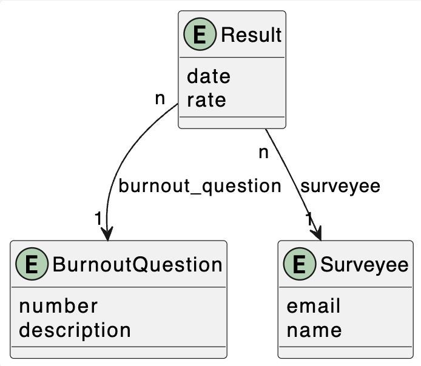

# Overview

According to the online journal [Psychology Today](https://www.psychologytoday.com/), *burnout* is a "a state of emotional, mental, and often physical exhaustion brought on by prolonged or repeated stress [...] caused by problems at work [...] parenting, caretaking, or romantic relationships." The same journal adds that "physical and mental exhaustion, a sense of dread about work, and frequent feelings of cynicism, anger, or irritability are key signs of burnout."

In this project, you will finish writing a set of Python scripts that will let surveyees know whether or not they are showing signs of *burnout*. All interactions with the database MUST be done using [SQLAlchemy](https://www.sqlalchemy.org/). The database used MUST be Postgres. 

# The Model 

File [models.py](src/models.py) implements the data model below (also in [model.wsd](uml/model.wsd)) using SQLAlchemy. This is given to you and you are NOT allowed to make any modifications to it. 



# The Database 

The first step in this project is to create the database, which should be based on Postgres. Use the provided SQL template [burnout.sql](src/burnout.sql) to create a database name *burnout* and a user with the same name having full access to the it. Save the database parameters in [config.ini](src/config.ini). 

Note: do NOT create the tables of the database as they must be created automatically by SQLAlchemy from the model. 

# Virtual Environment

Create a Python virtual environment and install all required packages using: 

```
pip3 install -r requirements.txt
```

# Questions Upload

Begin the coding part of this project by finishing [burnout_questions.py](src/burnout_questions.py), the script that reads the questions in [data/questions.txt](data/questions.txt) one at a time, instantiates an object of type **BurnoutQuestion** and saves it in the database. 

# Test Application

Next, finish [burnout_test.py](src/burnout_test.py), the script that applies a burnout test to a surveyee and saves the test results in the database. The script should also save the surveyee's information if it is the first time that the test is being administered to them. A typical run of **burnout_test.py** should look like the following: 

```
Welcome to the Burnout Test!
Is this the first time you are taking this test [Y|N]? Y
What's your email? mmojito@gmail.com
What's your name? Morbid Mojito
Please rate the questions using a scale from 0 (never) to 6 (always).
Academic activities make me feel emotionally drained [0|6]? 5
I lost interest in studying since I started college [0|6]? 4
I can effectively solve problems related to my studies [0|6]? 1
I feel physically exhausted at the end of a day at college [0|6]? 4
I have lost enthusiasm for studying [0|6]? 4
I participate effectively in the classes I attend [0|6]? 0
I'm exhausted from studying so much [0|6]? 6
I consider myself a good student [0|6]? 2
I have learned many interesting things during my studies in college [0|6]? 5
I feel tired in the morning when I get up and have to face another day at college [0|6]? 5
I distance myself from studies because I think they won't be really useful [0|6]? 4
I feel motivated to achieve goals with my studies [0|6]? 1
Studying or attending classes every day is very stressful for me [0|6]? 4
I doubt the importance and value of my studies [0|6]? 4
I am confident that I work effectively when carrying out in-class activities [0|6]? 1
```

Requirements for **burnout_test**: 

* it must read the questions that were already preloaded in the database; 
* it must check whether the surveyee already exists in the database; 
* it must create the surveyee if they don't exist in the database; 
* all results must be saved in the database with the date set as the current date. 

Feel free to use the helper functions shared in [helper_functions.py](src/helper_functions.py).

# Results

At last, finish [burnout_results.py](src/burnout_results.py) to show the result of a burnout test previously applied to a surveyee on a specific date. A typical run of **burnout_result.py** should look like the following: 

```
What's your email? mmojito@gmail.com
Welcome back Morbid Mojito!
When did you take the survey [YYYY-MM-DD]? 2024-04-19
Results:
Based on the results of the survey you took on 2024-04-19, you have signs of being exhausted because of ['high exhaustion', 'high cynicism', 'low academic effectiveness']
```

The interpretation of the results of a burnout test should be based on the following: 

|Scale|Questions|Signs of Burnout|
|---|---|---|
|Exhaustion|1,4,7,10,13|> 14|
|Cynicism|2,5,11,14|> 9|
|Academic Effectiveness|3,6,8,9,12,15|< 23|

# Rubric 

```
+10 database, user creation, and configuration file

+15 questions upload

+40 test application 

+35 results 
```